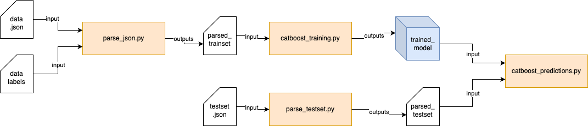
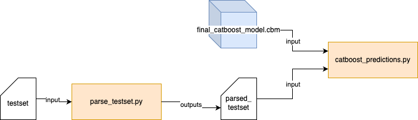

# Getting Started
This repository is organised as follows:

```
root
├── .github        # GitHub configuration files (e.g., workflows for CI/CD)
├── scripts        # Main scripts for data processing and model training
├── model          # Stored trained models
├── data           # Input raw data sets (in JSON)
├── output         # Results in CSV format from model predictions
└── tests          # Unit tests for scripts
```

## Main Flow
The main workflow consists of data processing, model training, and generating predictions. The component diagram below provides a high-level view:




## Installation
1. Clone the repo
```bash
git clone https://github.com/hoofangyu/dsa4262.git 
```
2. Move into dsa4262 directory
```bash
cd dsa4262
```
3. Create virtual environment (optional)
```bash
sudo apt install python3.8-venv
python3 -m venv <name_of_env>
```
4. Install required packages
```bash
sudo apt install python3-pip
python3 -m pip install -r requirements.txt
```

# Usage
## Using our Pre-Trained Model (Follow steps here for DSA4262 review)
By using our pre-trained model, the workflow will consist only the data processing and prediction generation steps. Here is the high-level view:



1. Move or download the testset directly to /data folder
2. Parse testset
```bash
python3 scripts/parse_testset.py <dataset_path> <output_file_name>
```

3. Run predition
```bash
python3 scripts/catboost_predictions.py <testing_path> <model_path> <output_name> [--parquet]
```
The `--parquet` flag is optional. Include this flag if you wish to save the output file as a Parquet format instead of the default CSV.

<br>

***

### Example Usage (for public online file)
Under the assumption that you're doing so on an AWS ubuntu instance: 
1. Download public testset to /data folder
```bash
aws s3 cp --no-sign-request s3://sg-nex-data/data/processed_data/m6Anet/SGNex_A549_directRNA_replicate5_run1/data.json data/
```
2. Parse testset
```bash
python3 scripts/parse_testset.py data/data.json eval
```
3. Run prediction
```bash
python3 scripts/catboost_predictions.py data/eval.parquet models/final_catboost_model.cbm SGNex_A549_directRNA_replicate5_run1_final_catboost_model_results --parquet
```

<br>

### Example Usage (for local file)
Under the assumption that you're doing so on an AWS ubuntu instance: 
1. Upload local testset to /data folder. On your local console, run the following:
```bash
# scp -i <local_pem_file_path> <local_testset_path> <host_name@ip_address:path_to_data_folder_in_dsa4262_folder_on_aws>
scp -i parkitect.pem data/dataset1.json.gz ubuntu@11.111.111.111:dsa4262/data
```
2. Parse testset
```bash
python3 scripts/parse_testset.py data/dataset1.json.gz eval
```
3. Run prediction
```bash
python3 scripts/catboost_predictions.py data/eval.parquet models/final_catboost_model.cbm dataset1_final_catboost_model_results --parquet
```
***

<br>

## Using our scripts to train your own model


