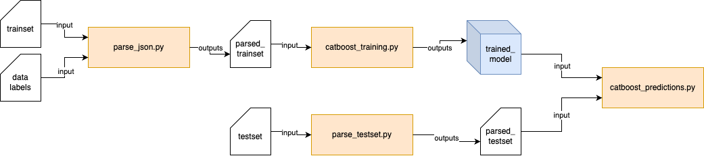

# Getting Started
Our repository is structured in the following way:

```
root
├── .github        # GitHub configuration files (e.g., workflows for CI/CD)
├── scripts        # Main scripts for data processing and model training
├── model          # Stored trained models
├── data           # Input raw data sets (in JSON)
├── output         # Results in CSV format from model predictions
└── tests          # Test cases for all modules
```

## Main Flow


Our repository primarily follows the above flow.


## Installation
1. Clone the repo
```bash
git clone https://github.com/hoofangyu/dsa4262.git 
```

2. Install required packages
```bash
python3 -m pip install -r requirements.txt
```

# Usage
## Using our pre-trained model (and for DSA4262)
High-level flow for pre-trained model usage:


1. Move or download the testset to /data folder
``` bash

```

2. Parse testset
```bash
```

3. Run predition
```bash
```